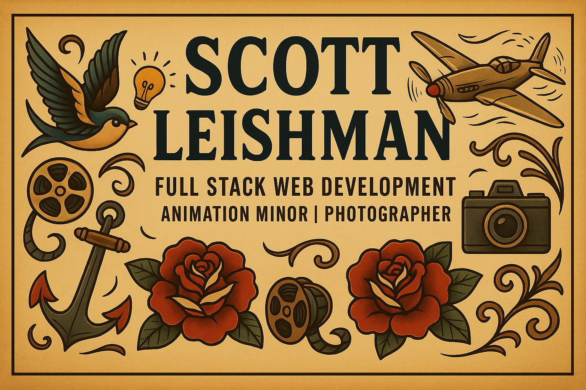

<h1 align="center">👋 Hey, I am Scott</h1>

  

  

  
  
  
  

---

## ⭐ Featured Projects

<!-- Row 1 -->
<table>
  <tr>
    <td width="48%" valign="top" align="center">
      <h3>🏔️ Alpine Bliss Resort</h3>
      
A two page responsive site that shows semantic HTML, accessible navigation, and minified deploys.

      

        
        
      

    </td>
    <td width="4%"></td>
    <td width="48%" valign="top" align="center">
      <h3>🍽️ Bistro 76</h3>
      
Course project that covers semantic sections, fragment links, forms, and image handling.

      

        
      

    </td>
  </tr>
</table>

<!-- Row 2 -->
<table>
  <tr>
    <td width="48%" valign="top" align="center">
      <h3>💆 Karma Day Spa</h3>
      
CSS fundamentals, selectors, layout, and type with an external stylesheet and validation.

      

        
      

    </td>
    <td width="4%"></td>
    <td width="48%" valign="top" align="center">
      <h3>🎬 Yale Poster Recreation</h3>
      
Grid study in InDesign that explores hierarchy, spacing, and rhythm. Exported for web presentation.

      

        
      

    </td>
  </tr>
</table>

---

## 🧭 About Me
I study **Graphic Information Technology** at **Arizona State University**, specialization in **Full Stack Web Development**, minor in **Animation**. I like clean structure, accessibility, and performance. I enjoy the problem solving side of coding and I want my work to feel simple for the user.

Outside school I shoot photos, follow aviation, play hockey, and enjoy traditional tattoo art. I like projects that mix visuals with interaction.

---

## 🛠 Skills in Progress

### Web and Code

  
  
  
  
  
  
  
  
  

### Creative Tools

  
  
  

---

## 📊 Stats

  
   
  

---

## 🧪 Playground
I keep small experiments on CodePen for layout, animation, and micro interactions.

  

---

## 📫 Connect

  
  
  

---

## ⚠️ Academic Honesty and License
This profile links to original coursework. Do not copy or submit any project as your own. You may reference the code, cite the source, and learn from it.

All repos are licensed under MIT unless noted. Credit is required.
